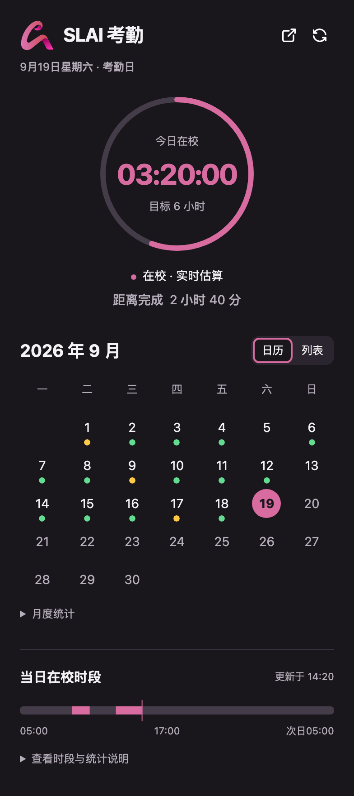

# SLAI 考勤小组件

在电脑 Chrome、独立安卓应用或 iPhone Safari 面板中查看今日在校时间、6 小时目标、当月日历及进出时段。学生自制的非官方工具，结果以学校系统为准；MIT 开源，运行时不使用 AI。

 

## 当前版本：1.5.1 · iOS Safari

- 新增 Safari 内考勤面板，通过免费的 Userscripts 导入。使用 Safari 学校登录，仅手动刷新，复用 Android / Chrome 的计算、分页和界面。
- 安装指引明确要求先为学生系统和登录站点分别请求桌面网站，再登录；补充关闭脚本后刷新或关闭旧标签页的停用步骤。
- Safari 版提供本机缓存、登录失效提示、读取中断和受限页面诊断；详细安装与验证范围见 [iOS 安装说明](docs/ios.md)。

[v1.5.1 发布页](https://github.com/TianQijia/slai-attendance-widget/releases/tag/v1.5.1)提供 Safari 脚本、安装 ZIP 和 SHA-256 校验文件。Android 和 Chrome 的安装包继续使用 [v1.4.2](https://github.com/TianQijia/slai-attendance-widget/releases/tag/v1.4.2)，包含以下改动：

- 修复学校实际使用的无文字、无分页栏空表误报超时，凌晨正常合并前一天记录；诊断补充查询日期、页面日期和表格状态。
- 安卓学校页面默认缩放到完整桌面宽度，支持双指缩放及“缩小／放大”按钮。
- 明细优先使用 90 条／页，超过一页继续串行读取，跨天合并两个自然日的记录。
- 修复 issue #4：Layui 的 `javascript:;` 空链接不再触发 Chrome CSP 报错，保留正常翻页事件。真正依赖脚本链接的控件会明确提示 `SWIPE_SCRIPT_URL`，并保留可靠快照。
- 新增独立 Android APK，直接在手机登录和采集学校数据，无需电脑或局域网 companion。
- 安卓界面复用桌面端的校徽、圆环、日历／列表、详情、进出时间轴和系统明暗主题。
- 安卓只在点击刷新时采集，Cookie 过期后重新登录；桌面 Chrome 保持每 30 分钟同步。
- companion 已从当前代码和构建中移除，旧版本说明与公开 Release 保留。

从源码构建可生成 `slai-attendance-widget-v1.5.1.zip`、`slai-attendance-android-v1.5.1.apk` 和 `ios-v1.5.1/` 内的 Safari 脚本与安装 ZIP。本次 v1.5.1 发布 Safari 安装文件，各平台已发布的安装包以 [GitHub Releases](https://github.com/TianQijia/slai-attendance-widget/releases) 为准。

## iPhone / iPad Safari 面板

下载 [Safari v1.5.1 安装 ZIP](https://github.com/TianQijia/slai-attendance-widget/releases/download/v1.5.1/slai-attendance-safari-v1.5.1.zip)，或单独下载 [Userscript 脚本](https://github.com/TianQijia/slai-attendance-widget/releases/download/v1.5.1/slai-attendance-safari.user.js)。

安装免费的 Userscripts，将构建产物 `slai-attendance-safari.user.js` 放入脚本目录并允许两个学校站点，然后用 Safari 普通标签页打开学校首页。**登录前，必须为学生系统 `stu.slai.edu.cn` 和登录站点 `sts.slai.edu.cn` 分别选择“页面菜单 → 更多（…）→ 请求桌面网站”**。完成学校登录后点“返回考勤并刷新”。无需 Apple 开发者会员或每周续签。[完整安装说明与已知限制](docs/ios.md)

不用时关闭 Userscripts 中的“SLAI 考勤 · Safari 手动版”，再刷新学校网页或关闭旧标签页即可停用；学校登录、桌面网站设置和本机考勤缓存会保留。[停用与恢复步骤](docs/ios.md#停用与恢复)

## 安装电脑扩展

下载 [Chrome v1.4.2 扩展 ZIP](https://github.com/TianQijia/slai-attendance-widget/releases/download/v1.4.2/slai-attendance-widget-v1.4.2.zip)。

1. 解压扩展 ZIP 到长期保留的文件夹。
2. 在 Chrome 打开 `chrome://extensions`，启用“开发者模式”。
3. 点击“加载已解压的扩展程序”，选择直接包含 `manifest.json` 的文件夹。
4. 在小窗点击“去登录”，使用自己的学校账号登录。已登录时可直接读取。

关闭小窗后，点击工具栏扩展图标可重新打开。小窗跟随系统明暗主题，月记录可切换日历／列表，点击日期查看详情。

更新时关闭旧小窗，把新版 ZIP 解压覆盖原文件夹，然后在扩展管理页点击“重新加载”。保留原路径和扩展实例可保留浏览器缓存；卸载会清除扩展存储。若使用源码，加载本项目的 `extension` 文件夹。

## 安装安卓 APK

下载 [安卓 v1.4.2 APK](https://github.com/TianQijia/slai-attendance-widget/releases/download/v1.4.2/slai-attendance-android-v1.4.2.apk)，或查看[发布说明与校验文件](https://github.com/TianQijia/slai-attendance-widget/releases/tag/v1.4.2)。已安装同签名测试版可直接覆盖安装。

1. 将 APK 传到自己的手机，打开并按系统提示允许该来源安装。
2. 打开“SLAI 考勤”，点击“去登录”。在内置学校页面使用自己的账号完成登录；页面默认显示完整桌面宽度，可双指缩放或用顶部“缩小／放大”按钮调整。
3. 点击“返回考勤”会回到面板并刷新一次；平时也可点右上角刷新。打开应用、回到前台或仅完成登录不会自行采集。
4. 登录失效时按提示重新登录，再手动刷新。账号设置中的“退出学校账号”会清除手机内的学校会话和考勤缓存。

支持 Android 8.0 及以上，需要可用且较新的 Android System WebView / Chrome。APK 使用手机自己的 WebView 会话；登录页和采集页使用相同的桌面 User-Agent，并在浏览器支持时设置对应桌面 Client Hints。不会导入、导出电脑 Cookie，也不会向电脑请求考勤数据。

安卓采集时请保持应用在前台。离开前台会中断本次采集并保留上次完整结果；下次需要手动刷新。完整数据超过 35 分钟后暂停估算，不把旧缓存显示成实时在校状态。学校实际登录、证书和页面行为由学校控制；错误说明只报告可观测原因。

## 统计规则

- 固定北京时间，考勤日为 **05:00（含）至次日 05:00（不含）**；凌晨仍属于前一天。
- 工作日目标为 6 小时；历史时长和工作日分类采用学校汇总。缺失日期标为待同步，未来日期不误标为零时长。
- 今日只使用完整学校道闸明细；忽略宿舍记录。连续进门取最晚一次，连续出门取最早一次，再累计有效闭合区间。
- **跨越 05:00 的整段不计入任一天，恰好 05:00 出校也作废。** 未闭合区间仅临时估算，到切日停止。
- 明细优先使用 90 条／页；学校页面仍提供其他页大小时保持完整翻页。凌晨串行读取前一天与当天自然日记录；翻页／切换页大小／跨自然日请求间隔 1.5 秒，两天合计最多 50 次明细页请求。
- 分页失败、总数变化、登录失效或切日竞态都不会把部分明细写成完整成功。已读到的学校历史汇总仍可展示；今日冻结可靠快照或显示暂无可靠数据。
- 绿点表示达到 6 小时（含节假日）；黄点仅标注未达标工作日。缺失、未来和未达标节假日不标点。

## 报错与缓存

排错卡片显示直接原因、失败阶段、稳定代码及建议操作。展开可查看查询日期、页面日期、表格状态、页码、条数、等待上限等现场信息；“复制排错信息”只复制脱敏诊断，自动复制受限时可手动复制。

Chrome 缓存由 `chrome.storage.local` 管理；Android 缓存位于应用私有目录；Safari 脚本缓存由 Userscripts 管理。覆盖升级不会把安装文件和用户缓存混在一起。账号、Cookie、会话 URL、原始学校页面和原始异常不进入应用诊断或发布包。[隐私说明](PRIVACY.md)

## 旧版 companion（已停用）

当前版本不再提供局域网服务、配对入口或 companion 安装包。GitHub 的旧 Release 及附件保持原样，可用于查阅或继续运行完整的旧版本组合。

- [完整保留的 v1.3.0 README](docs/legacy-v1.3.0-README.md)
- [旧版手机查看、排错、停止与卸载说明](docs/mobile.md)
- [旧版隐私说明](docs/legacy-v1.3.0-PRIVACY.md)
- [v1.3.0 Release](https://github.com/TianQijia/slai-attendance-widget/releases/tag/v1.3.0)

若电脑还在运行旧服务，可按旧版说明停止并取消自动启动。升级扩展会清理已停用的配对设置；项目不会自动删除电脑上的旧服务数据或修改旧 Release。

## 开发与验证

需要 Node.js 22+。所有自动化测试均使用虚构学校页面，不读取真实账号。

```sh
npm ci
npx playwright install chromium webkit
npm test
npm run audit:release
npm run build
npm run test:install
```

可设置 `CHROMIUM_EXECUTABLE_PATH` 指向本机 Chrome。最终 ZIP 安装测试使用临时浏览器配置，验证真实隔离脚本、空明细、三页 23 条及每页 90 条的 93 条记录、CSP console/CDP 日志、失败回退、诊断复制及恢复。

安卓需要 JDK 17+、Android SDK 平台 35、Build Tools 35.0.0，并配置 `ANDROID_HOME`。Gradle Wrapper 固定版本和 SHA-256。

```sh
npm run build:android
# 启动隔离的 Android 模拟器后运行 release APK 仪器测试
npm run test:android
```

安卓构建同时编译 release APK、测试 APK 并运行 Lint。签名密钥首次在本机 `local-data/android-signing` 生成，目录已忽略；请私下备份，用于以后覆盖升级，不能提交到仓库或放入分发包。`npm run test:android` 使用相同签名的 release 构建；仪器测试的虚构页面只打入测试 APK。

`npm run build:ios` 单独构建 Safari 脚本及安装 ZIP；`npm run test:ios` 在 Chromium 和 WebKit 上运行虚构学校页面流程，`npm run test:install` 还会验证最终 Safari ZIP。此验证不能替代 iPhone 上真实学校登录与会话保留试用。

`release-files.json` 明确列出源码、扩展 ZIP、Android 网页资源和 Safari 输入／ZIP 内容；手机界面与采集器在构建时从共享源码生成，不复制维护计时逻辑。`npm run preview` 提供仅含虚构数据的桌面预览。

## 许可

代码采用 [MIT](LICENSE)。校徽权利归原权利人，来源及单独许可见 [NOTICE](extension/icons/NOTICE.md)，不代表学校授权或背书。反馈时请勿附带账号、Cookie、会话链接或真实考勤截图。
