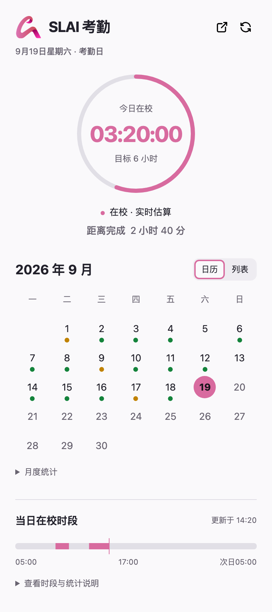

# SLAI 考勤小组件

在 Chrome 独立小窗里查看今日累计在校时间、距 6 小时还差多久，以及当月每日考勤。

学生自制的非官方工具，计算结果以学校系统为准。MIT 开源；运行时不使用 AI。



## 安装（无需编程环境）

1. 下载版本对应的 `slai-attendance-widget-v版本号.zip`（公开版本见 [Releases](https://github.com/TianQijia/slai-attendance-widget/releases)）。
2. 解压到一个准备长期保留的文件夹，不要直接在压缩包里打开。
3. 在 Chrome 地址栏输入 `chrome://extensions`，打开右上角“开发者模式”。
4. 点击“加载已解压的扩展程序”，选择包含 `manifest.json` 的解压文件夹。
5. 小窗出现后，如提示登录，点击“去登录”，使用**自己的学校账号**在学校页面登录。完成后会重新读取考勤。

关闭小窗后，点击 Chrome 工具栏的扩展菜单 → “SLAI 考勤小组件”即可重新打开。Chrome 启动时也会打开小窗。

如果下载的是 GitHub 自动生成的 Source code 压缩包，请加载其中的 `extension` 文件夹。

## 手机局域网查看（1.2.0）

手机与电脑连接同一可信 Wi-Fi。下载并解压对应的伴随服务 ZIP：macOS Apple Silicon 使用 `darwin-arm64`，Windows 64 位使用 `win-x64`；两种包均内置 Node.js 22.23.2，无需安装编程环境。扩展仍需按照上方步骤更新。

1. 在解压目录的 `companion` 文件夹双击 `start.command`（Mac）或 `start.cmd`（Windows）。把软件放在长期保留的文件夹。
2. 启动器打开本机连接信息页；把**本机配对码**粘贴到扩展小窗底部的“手机查看”，点击“启用并连接”，允许本机连接权限。
3. 将信息页中的**手机查看链接**传到自己的手机并打开。链接包含独立查看令牌；本机配对码不要交给手机。展开页面底部“私人局域网查看”，可勾选“在此浏览器记住查看权限”，以后同一地址新开标签页也能查看。再次查看链接可运行 `connection-info` 工具。
4. Windows 若阻止手机访问，把当前网络设为可信的“专用网络”；管理员运行 `allow-private-network.ps1`，仅放行本子网到内置 Node 的 TCP 32100。电脑若有多个局域网地址，启动器会要求选择手机所在网络。

`stop` 停止服务；`enable-autostart` 设置下次登录后启动，`disable-autostart` 取消。自动启动不替你打开 Chrome。Mac 下载的启动脚本首次运行可能需要在系统设置中允许打开；不需要关闭系统安全保护。数据目录中 `connection.html` 可直接打开查看配对信息。

### 网络检测（Mac 和 Windows）

手机访问失败时，在电脑的 `companion` 文件夹双击 `diagnose.command`（Mac）或 `diagnose.cmd`（Windows）。**服务未启动时也能运行**，不需要安装 Node 或输入命令。检测会打开报告页，点击“复制脱敏报告”即可反馈；复制失败时可手动复制已选中的文本。换网络、重启服务或修正设置后，再运行一次检测获得新结果。

- 共同检测：当前是否有私有局域网 IPv4、已选地址是否仍属于本机、本机查看接口、写入端口、电脑访问自己的局域网接口、扩展最近联系及今日完整快照更新时间。
- Mac：读取应用防火墙开关、阻止所有入站设置及随包 Node 的应用规则。Windows：读取所选地址的公用／专用／域网络类型、防火墙状态，以及随包规则的程序路径、端口和范围是否匹配。查询受权限或系统限制时明确显示“未能确认”。
- 所有检测均为只读，不改动网络类型、防火墙规则或学校同步，也不向服务上传测试考勤。单次接口探测最多等待 3 秒，系统查询有时间上限。
- 电脑自测不能证明手机到电脑可达，不能单凭超时判断校园网开启了设备隔离。手机能打开查看页时，在底部展开“连接与排错”中的“网络检测”并点击“开始网络检测”，可复制这台浏览器的连接结果；完全打不开时先反馈电脑报告和浏览器显示的现象，可用自己的可信热点做对照。
- 到 Windows 或换网络后，使用该电脑新生成的配对码和查看链接。校园网是公用或域网络时，随包的专用网络规则不会生效；按管理员允许的方式配置，不需要关闭整个防火墙。

检测报告保存在用户数据目录的 `network-diagnostic.html` 和 `network-diagnostic.local.json`，包含固定检测代码、阶段、HTTP 状态、等待上限及时间差，不包含密钥、IP、网络名称、用户名、文件路径、原始异常或考勤明细。报告是一次检测的快照，不会后台探测校园设备。

- 手机顶部“刷新学校数据”会通知电脑 Chrome 扩展，立即重新采集学校汇总与完整明细，并显示等待接收、正在抓取、完成或具体错误。电脑需运行新版扩展并启用手机查看；升级后在 `chrome://extensions` 重新加载扩展。已有采集进行时共用同一次采集，连续请求合并，新的手机请求至少间隔 10 秒。
- 手机平时每 15 秒读取电脑缓存；手动刷新进行中每秒读取进度，完成后恢复原间隔。自动查看不会触发学校采集，学校自动同步仍为 30 分钟；扩展每分钟向本机推送缓存，并通过本机连接即时接收手动刷新请求。服务重启不会自动重放旧请求。
- “私人局域网查看”和“连接与排错”位于考勤下方，默认折叠。前者用于恢复链接、记住权限及退出，后者提供诊断、网络检测和“重新连接查看服务”。重新连接只读取电脑缓存。缺少权限时，顶部保留一个前往连接设置的简短提示。
- 超过 150 秒没有扩展联系、本次学校完整同步超过 35 分钟、登录失效或服务不可达时，冻结到上次完整同步时刻。服务重启保留缓存，但收到扩展新联系前显示未联系；接收旧缓存不会改变学校更新时间。
- 查看端为所选局域网 IPv4 与 `127.0.0.1` 的 32100；写入端只有 `127.0.0.1:32101`。不监听 `0.0.0.0`，不开放公网。HTTP 不提供传输加密，仅适用于可信 Wi-Fi；Tailscale／HTTPS 和离线 PWA 不属于本轮交付。
- 查看链接中的令牌读取后从地址栏移除。默认只在当前标签页保存；勾选“记住查看权限”且服务验证成功后，才在该地址的浏览器本地存储中保存查看令牌。可用“退出并清除保存的权限”退出本页并清除本页会话和该地址的已记住权限；其他已经打开的标签页需一并关闭。普通 HTTP 不保证后台离线页面可用。
- 出现 `VIEW_TOKEN_MISSING` 时，本页没有查看权限，输入 IP 地址无法补回令牌。展开底部“私人局域网查看”，粘贴电脑连接信息中的完整“手机查看链接”，或在浏览器直接重新打开该链接。`VIEW_TOKEN_REJECTED` 表示服务已响应 HTTP 401，请重新取得电脑提供的链接。存储受浏览器限制时，可在当前页使用完整链接连接，并查看具体存储诊断。
- HTTP 手机页面可能不提供自动剪贴板接口。点击复制后若弹出“手动复制本次报告”，请长按文本框，选择“全选／复制”；电脑可按 Ctrl+C 或 ⌘C。文本框保留点击时的脱敏报告，不受后台刷新影响。只有自动复制确实成功才显示“已复制”。
- IP 改变后重启服务并使用新查看链接。断连不推断为学校风控、电脑关闭或网络故障，只报告实际可确认的状态。

本机配置及缓存位置：Mac 为 `~/Library/Application Support/SLAIAttendance`，Windows 为 `%LOCALAPPDATA%/SLAIAttendance`。卸载时先取消自动启动、停止服务，再删除解压文件夹及该数据目录；Windows 防火墙规则名为 `SLAI-Attendance-Viewer`，可在系统防火墙中删除。删除配置会生成新令牌，需要重新配对。

开发运行使用 `npm run start:companion`；可用 `node companion/cli.js start --host 私有IPv4` 明确指定本机地址。连接信息包含令牌，不要上传到 Issue。

## 如何计算

- 工作日目标为 6 小时；工作日、节假日分类采用学校页面显示。
- 只使用名称为“闸机-…”或“闸机_…”的学校道闸，忽略宿舍道闸。
- 学校第二天才显示每日累计：昨天及更早直接采用学校汇总，今天只用完整进出明细自行计算。连续进门取最晚一次、连续出门取最早一次，再累加有效在校区间；同秒异向保留读取顺序。最后为进门时，每秒本地续算。
- 中途离校再进校，只累计在校区间。例如在校 2 小时、离校 1 小时、再在校 1 小时，累计为 3 小时。
- 每 30 分钟从学校获取一次记录。离校后界面可能暂时继续增长，下次同步会重新计算并纠正；数字是根据最近记录估算的，不代表实时定位。
- 当天明细会逐页读取、合并去重；支持学校 Layui 的箭头分页，翻页间隔 1.5 秒，最多 50 页。等待每页数据加载完成后再读取，固定列的重复表格不会重复计数。
- 若明细分页失败或总条数不一致，历史仍显示学校汇总；今天冻结到上次完整同步时刻，没有当天完整快照则显示“暂无可靠数据”。不使用部分明细。汇总与完整明细更新时间分别保留。
- 今天不使用学校汇总作为下限。学校汇总没有今天、月初显示空表时，仍继续读取今日明细。统一使用上海时区；跨日不把本地估算写入学校历史。

## 更新与常见问题

**如何更新？** 关闭小窗，将新版 ZIP 解压覆盖原扩展文件夹，在 `chrome://extensions` 点击该扩展的重新加载按钮，再打开小窗。不要同时加载两个副本。

**为什么时长不增加？** 若最新学校道闸记录为出门，计时应暂停。先核对学校最新进出记录和上次刷新时间。

**1.1.1 记录多时提示读取失败？** 该版未识别学校 Layui 的箭头分页，会将第一页误判为最后一页，随后因条数不齐而失败。请更新至 1.2.0；新版已覆盖 23 条、3 页及中间整页为宿舍记录的情况。

**提示“今日估算已暂停”？** 历史汇总已读到，但今天明细未完整读到。今天显示上次完整结果及其同步时间并暂停增长；若没有当天完整快照，显示暂无可靠数据。可在电脑端或手机顶部刷新学校数据。

**怎样反馈报错？** 查看界面的直接原因和建议操作，点击“复制排错信息”后把文字反馈给维护者。“查看错误代码和现场细节”可展开同一份信息；若浏览器拒绝自动复制，可以手动复制已选中的文本。信息包含扩展版本、发生时间、错误代码、失败阶段，以及已知的页码、条数和等待上限，不含账号或原始记录。例如第 2 页超时会给出 `SWIPE_TIMEOUT`、已读 10 条、预期 23 条、等待上限 15 秒；总数变化会直接说明从多少条变成多少条。无法确认的原因会明确标为未知。

**登录过期怎么办？** 点击“去登录”。登录失效期间自动采集暂停；完成登录后再继续。网络失败时保留上次结果和上次成功更新时间。

**能手动刷新吗？** 可以点扩展右上角刷新，或手机顶部“刷新学校数据”。手机通过本机服务通知同一扩展采集；刷新完成后重新安排 30 分钟后的自动同步。请不要频繁点击，低频同步不能保证免于学校风控。

**需要一直开着 Chrome 吗？** 需要 Chrome 运行才能同步；电脑休眠或 Chrome 关闭时不会采集，恢复后以实际同步结果为准。

**有哪些限制？** 仅适配当前 SLAI 学生工作系统；页面结构、道闸命名或学校规则变化可能需要更新。遇到记录缺失或异常，以学校结果为准。

## 隐私

学校账号和登录 Cookie 由各自浏览器持有，下载扩展不会获得作者的登录状态。扩展不读取密码，不保存学号与会话链接，在本机保存必要的考勤缓存；启用可选伴随服务后，持查看令牌的局域网设备可以读取脱敏考勤并请求扩展刷新学校数据，不能写入考勤。[完整隐私说明](PRIVACY.md)

## 开发与检查

需要 Node.js 22+。普通使用者无需安装 Node.js。

```sh
npm ci
npx playwright install chromium
# macOS 上还需 WebKit，用于手机查看页回归测试
# npx playwright install webkit
npm test
npm run audit:release
npm run build
npm run test:install
```

计时测试使用固定虚拟时间，所有测试都使用虚构页面，不登录学校系统。安装测试在临时浏览器配置中加载 ZIP 解压结果，验证手机按钮通过本机服务触发真实扩展采集、未登录状态、真实扩展脚本隔离环境下的 Layui 异步翻页、超时及总数变化时的汇总回退与刷新恢复。

若 Playwright 自带的浏览器在本机无法启动或下载，可将 `CHROMIUM_EXECUTABLE_PATH` 环境变量指向本机 Chrome 或官方 Chrome for Testing 可执行文件，再运行测试。安装测试通过 Chrome 的扩展测试接口加载 ZIP，仍使用临时配置，不使用日常浏览器账号。

构建默认从 Node.js 官方下载固定运行时并核对 SHA-256；官网连接不可用时可设置 `SLAI_RUNTIME_MIRROR=1` 使用镜像，仍必须通过相同官方校验和。CI 对 macOS arm64 与 Windows x64 分别运行完整测试及最终 ZIP 安装验证。原始最终扩展 ZIP 会先通过不修改清单的安装测试；组合推送测试仅在一次性测试拷贝中把已声明的本机权限预授权，应用脚本保持 ZIP 原样，发布清单不改动。手机刷新组合测试将首次学校导航放到已注册的空白测试页，以确保模拟响应在导航前接管；采集与桥接脚本不替换，翻页和脚本注入使用真实 Chrome。首次浏览器授权弹窗需使用者本人确认，不计为无头测试已覆盖。测试不会读取日常 Chrome 配置。

`release-files.json` 明确列出允许提交与打包的文件，并逐文件固定伴随服务所需 `ws` 运行代码与许可证的 SHA-256。构建脚本仅打包列出的扩展文件、许可证和说明；不递归压缩工作目录。测试截图写入 `test-results/`；公开演示图使用 `UPDATE_DEMO=1 npm test` 重新生成。

发布前还需人工检查演示图片及扫描待发布内容；`.gitignore` 不会清除已经写在源码中的个人信息。

项目的[错误诊断准则](AGENTS.md)要求新增错误保留直接原因和现场信息，并验证它们经过缓存清洗、界面显示和复制后仍可用于排查。

## 许可

[MIT](LICENSE)。欢迎反馈与贡献；Issue 请勿附带账号、Cookie、会话链接或未脱敏的考勤记录。
